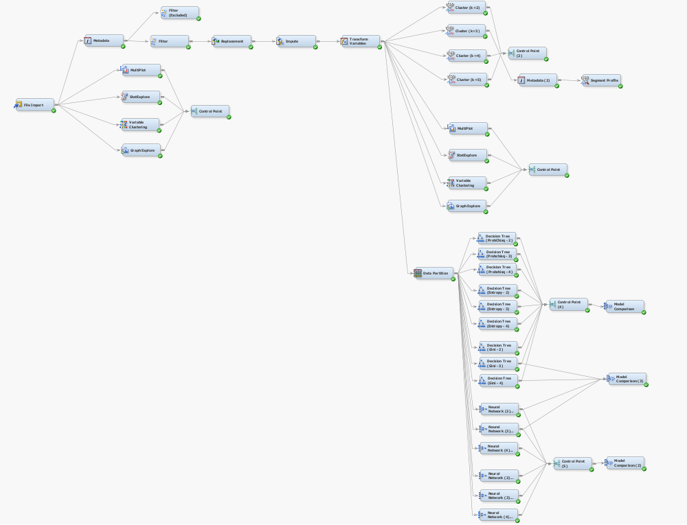

# Health and Beauty Pharmacy - Predictive Marketing Analysis

## Project Overview
This project focuses on helping Health and Beauty Pharmacy (HBP) identify customers most likely to purchase a new nutritional appointment service. Using predictive modeling in SAS Enterprise Miner, we developed targeted strategies to minimize marketing costs while maximizing profitability.

## Objective
The primary objectives were to:
1. Analyze customer data to identify profiles likely to purchase the new service.
2. Develop predictive models to recommend customers for targeted marketing campaigns.
3. Evaluate and compare model performance to ensure cost-efficient marketing strategies.

## Problem Statement
HBP introduced a new nutritional appointment service but faced challenges in determining which customers to target. Sending promotional emails indiscriminately incurs high costs. The goal was to identify customers more likely to purchase the service using data science techniques and predictive modeling.

## What Was Done
### Data Preprocessing
1. **Variable Analysis and Cleaning**:
   - Imputed missing values using tree-based methods.
   - Filtered out outliers and adjusted variable ranges.
2. **Feature Engineering**:
   - Created variables like `Rate_of_Income` and `Money_per_purchase` to enhance predictive power.
3. **Clustering**:
   - Segmented customers into three clusters based on behavior:
     - **Youngsters**: Low financial capacity, frequent online purchases.
     - **Average Buyers**: Focus on purchasing medicines.
     - **Rich/Seniors**: High income, frequent purchases of various products.

### Predictive Modeling
1. **Decision Trees**:
   - Tested Gini, Entropy, and Probchisq criteria with varying branch depths.
   - Identified the Gini model with 3 branches as the best for predicting a 5% target outreach.
2. **Neural Networks**:
   - Tested models with 2, 3, and 4 hidden units.
   - Found the model with 2 hidden units to perform best for a 10% outreach.
3. **Model Comparison**:
   - Compared ROC and Cumulative Lift charts to assess model performance.
   - Selected models based on the percentage of customers targeted:
     - Decision Tree (5% outreach).
     - Neural Networks (10% and 15% outreach).

     
   *Figure: SAS Diagram*

### Insights
- Older customers with higher income and frequent purchases are more likely to purchase the nutritional service.
- Customers in the "Rich/Seniors" cluster are ideal for marketing campaigns.
- Customers spending more per purchase are likelier to buy the new service, while those with high income percentages spent on pharmacy products are less likely.

## Recommendations
1. **Targeted Marketing**:
   - Use Decision Trees for smaller outreach campaigns (5%).
   - Switch to Neural Networks for larger campaigns (10% or more).
2. **Cluster-Based Targeting**:
   - Focus on the "Rich/Seniors" cluster for high-value returns.
3. **Future Improvements**:
   - Include seasonal data to refine predictions.
   - Address limitations like non-representative sample data.

## Conclusion
This analysis provided HBP with actionable insights and predictive models for cost-efficient marketing of their new service. By targeting the right customers, HBP can maximize returns on their promotional efforts while minimizing costs.
